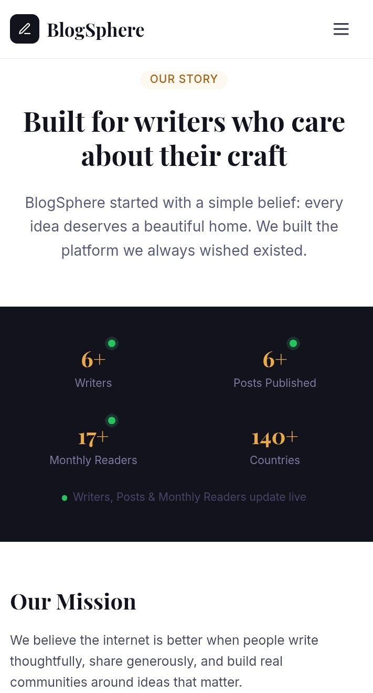
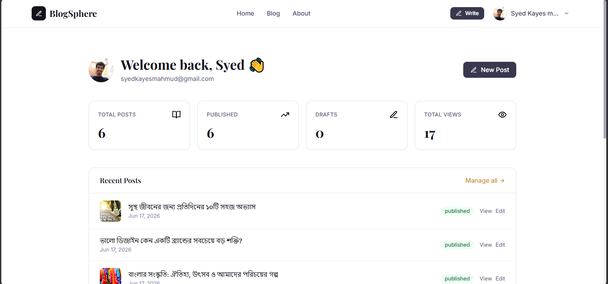
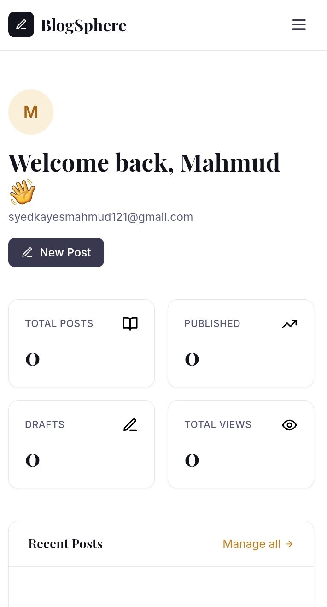

# 🖊️ BlogSphere

> A modern full-stack blogging platform built with React, Tailwind CSS, and Supabase — featuring secure authentication, role-based admin management, rich text editing, image uploads, and a fully responsive experience.

**🔗 Live Demo:** [blogsphere-t5id.vercel.app](https://blogsphere-t5id.vercel.app/)

---

## 📸 Screenshots

| Home | About |
|---|---|
| /) | )/ |

| Blog Editor | Admin Dashboard |
|---|---|
| )) | / |

> *Add your screenshots to a `/screenshots` folder in the repo root, matching the filenames above.*

---
## Features

- 🔐 Secure authentication (sign up / sign in / sign out)
- 👤 Role-based access: `reader` · `author` · `admin`
- ✍️ Rich blog editor with cover image upload
- 🏷️ Categories, excerpts, read-time estimation
- 💬 Comment system with admin moderation
- 📊 Author dashboard with post stats
- 🛡️ Admin panel — manage posts, users, comments
- 📱 Fully responsive design

---

## Project Structure

```
blogsphere/
├── src/
│   ├── components/
│   │   ├── common/          # Navbar, Footer, Avatar, Spinner, Pagination, ConfirmModal, EmptyState
│   │   └── blog/            # BlogCard, BlogGrid, BlogForm, CommentSection
│   ├── pages/
│   │   ├── Home.jsx
│   │   ├── Blogs.jsx
│   │   ├── BlogDetails.jsx
│   │   ├── About.jsx
│   │   ├── Login.jsx
│   │   ├── Register.jsx
│   │   ├── Dashboard.jsx
│   │   ├── AddBlog.jsx
│   │   ├── EditBlog.jsx
│   │   ├── ManageBlogs.jsx
│   │   ├── ProfilePage.jsx
│   │   ├── NotFound.jsx
│   │   └── admin/
│   │       ├── AdminDashboard.jsx
│   │       ├── AdminPosts.jsx
│   │       ├── AdminUsers.jsx
│   │       └── AdminComments.jsx
│   ├── layouts/
│   │   ├── MainLayout.jsx
│   │   └── AdminLayout.jsx
│   ├── routes/
│   │   └── AppRoutes.jsx
│   ├── hooks/
│   │   ├── useBlogs.js
│   │   └── useCategories.js
│   ├── context/
│   │   └── AuthContext.jsx
│   ├── services/
│   │   ├── supabase.js
│   │   ├── authService.js
│   │   ├── blogService.js
│   │   ├── adminService.js
│   │   └── profileService.js
│   ├── utils/
│   │   ├── helpers.js
│   │   └── constants.js
│   ├── App.jsx
│   ├── main.jsx
│   └── index.css
├── supabase-schema.sql
├── .env.example
└── package.json
```


## Roles

| Role     | Capabilities |
|----------|-------------|
| `reader` | Browse & read posts, leave comments |
| `author` | All reader perms + create/edit/delete own posts |
| `admin`  | All author perms + admin panel (manage all posts, users, comments) |


## Tech Stack

| Layer     | Technology |
|-----------|-----------|
| Frontend  | React 18 + Vite |
| Styling   | Tailwind CSS |
| Backend   | Supabase (Postgres + Auth + Storage) |
| Routing   | React Router v6 |
| Toasts    | react-hot-toast |
| Icons     | lucide-react |
| Dates     | date-fns |

